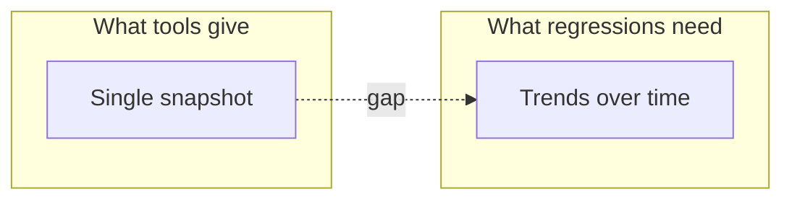
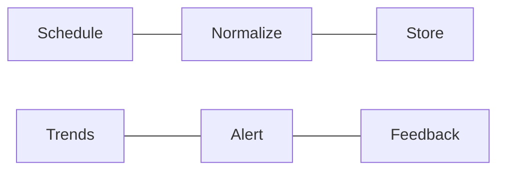
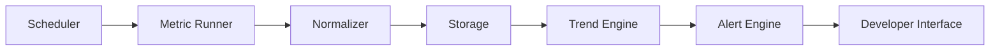

# Performance Monitoring Playbook

Modern web performance tools excel at providing snapshots but often fall short in highlighting gradual regressions.

This repository outlines practical patterns for continuously tracking web performance metrics, detecting early degradations, and designing alerts that developers can trust.

**Topics:** `performance` `core-web-vitals` `LCP` `INP` `CLS` `Lighthouse` `PageSpeed Insights` `performance monitoring` `regression detection` `performance budgets` `frontend performance` `performance alerts` `time-series metrics` `Web Vitals` `performance dashboard` `continuous monitoring`

## The Real Problem

While tools like PageSpeed Insights (PSI) and Lighthouse offer valuable insights, they primarily focus on single-point measurements.

However, performance issues often manifest gradually, making them harder to detect without continuous monitoring.

## What Real Monitoring Requires

Effective performance monitoring systems typically encompass:

- **Scheduled Data Collection:** Automated, periodic metric gathering to ensure consistent data over time.
- **Metric Normalization:** Standardizing data formats for easier analysis and comparison.
- **Historical Storage:** Maintaining a time-series database to track performance trends.
- **Trend Detection:** Analyzing data to identify significant changes or regressions.
- **Noise-Aware Alerting:** Implementing alert systems that minimize false positives and focus on actionable insights.
- **Clear Feedback Loops:** Providing developers with understandable and timely information to facilitate prompt action.

## Reference Architecture

A typical performance monitoring pipeline includes:

- **Scheduler:** Triggers periodic data collection.
- **Metric Runner:** Executes performance tests using tools like PSI or Lighthouse.
- **Normalizer:** Processes raw data into a consistent format.
- **Storage:** Archives data for historical analysis.
- **Trend Engine:** Identifies patterns and anomalies over time.
- **Alert Engine:** Generates notifications based on predefined thresholds.
- **Developer Interface:** Dashboards or tools for developers to view and act upon performance data.

## Hard Lessons from Real-World Implementations

- **PSI Rate Limits:** Frequent API calls can quickly exhaust quotas. Implement caching and backoff strategies.
- **LCP Variability:** Largest Contentful Paint (LCP) can fluctuate due to numerous factors. Use rolling averages for stability.
- **Device Discrepancies:** Performance metrics can differ significantly between mobile and desktop. Monitor both separately.
- **Alert Fatigue:** Overly sensitive alerts can desensitize teams. Ensure alerts are meaningful and actionable.

## Minimal DIY Implementation

A basic setup might involve:

- **Running PSI:** Automate data collection using PSI's API.
- **Storing Results:** Save JSON responses in a structured format.
- **Threshold Alerts:** Implement simple checks, e.g., alert if LCP exceeds 2500ms.

While straightforward, this approach can quickly become complex when scaling or aiming for higher accuracy.

## Deep Dive Topics

If you want to go deeper into specific parts of performance monitoring design:

- **Designing Alert Systems Developers Don't Ignore**  
  -> [docs/designing-alert-systems-developers-dont-ignore.md](docs/designing-alert-systems-developers-dont-ignore.md)
- **Why PSI Scores Change Between Runs**  
  -> [docs/why-psi-scores-change-between-runs.md](docs/why-psi-scores-change-between-runs.md)
- **How Often Should You Run PSI For Monitoring?**  
  -> [docs/how-often-should-you-run-psi-for-monitoring.md](docs/how-often-should-you-run-psi-for-monitoring.md)
- **Tracking Core Web Vitals Over Time: Architecture and Data Model**  
  -> [docs/tracking-core-web-vitals-over-time.md](docs/tracking-core-web-vitals-over-time.md)
- **Storing Performance Metrics: Schema & Tradeoffs**  
  -> [docs/storing-performance-metrics.md](docs/storing-performance-metrics.md)

## Prefer a Ready-Made Solution?

If building and maintaining such a system isn't feasible, consider using [WebVitalsKit](https://app.webvitalskit.com), a tool designed to handle these challenges out of the box.
